# 🎵 MOOD - Your Spotify Music Explorer
A command-line interface tool to explore and manage your Spotify music in style. Features coming soon...
> ⚠️ **Project Status: In Development**  
## ⚠️ Disclaimer
This project is not hosted - you'll need to create your own Spotify Developer application and use your own API credentials to run this code.

## ✨ Features
coming soon...

## Structure
waitlist/
├── README.md
├── LICENSE.md
├── genius_auth.mermaid
├── waitlist.mermaid
├── data/                  # All generated, cache, and ignored files (in .gitignore)
│   ├── misc/              # development files
│   ├── prod/
│   │   ├── .spotify_cache
│   │   └── cache.json
│   └── songs.db
└── src/                   # Main source code
    ├── database/
    │   ├── factory.db
    │   └── track_attributes.py
    ├── ai.py
    ├── audio_db.py
    ├── cache_manager.py
    ├── env.py
    ├── genius_auth.py
    ├── genius.py
    ├── main.py
    ├── spotify.py
    └── utils.py 


## Flowchart

```mermaid
---
id: 992c9263-f454-4cd3-b500-30659d0e586b
title: waitlist.py
---
flowchart TD
    %% Main program flow
    Start([fa:fa-play Start]):::start --> LoadEnvVars[fa:fa-cog load_env_variables]:::setup
    LoadEnvVars --> InitSpotify[fa:fa-spotify initialize_spotify_client]:::spotify
    InitSpotify --> InitGemini[fa:fa-robot initialize_gemini_client]:::ai
    InitGemini --> InitGenius[fa:fa-music initialize_genius_client]:::api
    InitGenius --> LoadCache[fa:fa-database load_cache_data]:::data
    LoadCache --> CreatePlaylistManager[fa:fa-list Create PlaylistManager]:::manager
    
    %% Main menu that directs the program flow
    CreatePlaylistManager --> WhatToDo{fa:fa-question-circle what_to_do}:::decision
    
    WhatToDo -->|New Recommendations| NewRecsQuestion{fa:fa-question Where?}:::decision
    NewRecsQuestion -->|Default Playlist| CheckDefaultPlaylist{Default playlist exists?}:::decision
    CheckDefaultPlaylist -->|Yes| ClearPlaylist[fa:fa-trash playlist_replace_items]:::action
    CheckDefaultPlaylist -->|No| NotifyUser[fa:fa-exclamation-triangle Notify user to set default]:::warning
    ClearPlaylist --> BasicProcessDefault[basic_process with default_playlist_id]:::process
    
    NewRecsQuestion -->|Create New Playlist| BasicProcess[basic_process]:::process
    NewRecsQuestion -->|Add to Queue| AddToQueue[fa:fa-plus add_to_queue]:::action
    
    WhatToDo -->|Settings| SettingsMenu[fa:fa-cogs settings]:::settings
    SettingsMenu --> BasicSettings{fa:fa-sliders-h Settings choice}:::decision
    
    %% Advanced settings for managing API keys and cache
    BasicSettings -->|Advanced Settings| AdvancedSettings{fa:fa-tools Advanced Settings choice}:::decision
    AdvancedSettings -->|Clear Auth| ClearAuth[fa:fa-trash-alt Clear .spotify_cache]:::danger
    AdvancedSettings -->|Change API Key| ChangeAPIKey[fa:fa-key Update Gemini API]:::action
    AdvancedSettings -->|Clear Cache| ClearCache[fa:fa-eraser Reset cache data]:::danger
    AdvancedSettings -->|Output Cache| OutputCache[fa:fa-print Print cache data]:::action
    AdvancedSettings -->|Back| SettingsMenu
    
    %% Default playlist management
    BasicSettings -->|Set Default Playlist| SetDefault[fa:fa-star Update default_playlist_name]:::action
    SetDefault --> OverrideOrCreate{fa:fa-question Override or Create?}:::decision
    OverrideOrCreate -->|Override| ChangePlaylistName[fa:fa-edit change_playlist_name]:::action
    OverrideOrCreate -->|Create New| CreatePlaylist[fa:fa-plus-square create_playlist]:::action
    ChangePlaylistName --> UpdatePlaylistCache[fa:fa-save Update playlist cache]:::data
    CreatePlaylist --> UpdatePlaylistCache
    
    BasicSettings -->|Change Playlist Name| ChangeName[fa:fa-edit change_playlist_name]:::action
    BasicSettings -->|Change Description| ChangeDesc[fa:fa-pen Update playlist description]:::action
    BasicSettings -->|Change Default Limit| ChangeLimit[fa:fa-sliders-h Update default_limit]:::action
    BasicSettings -->|Back| WhatToDo
    
    WhatToDo -->|Nothing| End([fa:fa-stop End]):::END
    
    %% Core recommendation process
    subgraph BasicProcessFlow["Basic Process Flow (Main Recommendation Engine)"]
        direction TB
        BasicProcess --> GetDiscoveryType[fa:fa-compass get_discovery_type]:::action
        GetDiscoveryType -->|"User selects: same music/mood/genre"| FromWhere[fa:fa-search from_where]:::action
        FromWhere -->|"Returns Spotify ID"| GetOriginName[fa:fa-tag id_to_element_name]:::action
        GetOriginName --> CheckIsTrack{fa:fa-question Is track?}:::decision
        CheckIsTrack -->|Yes| ProcessTrackRec[fa:fa-magic process_track_recommendation]:::process
        ProcessTrackRec -->|"Returns list of recommendations"| CheckPlaylistId{fa:fa-question playlist_id exists?}:::decision
        CheckPlaylistId -->|No| CreateNewPlaylist[fa:fa-plus-square create_playlist]:::action
        CreateNewPlaylist --> FillPlaylist[fa:fa-fill-drip fill_playlist]:::action
        CheckPlaylistId -->|Yes| FillExistingPlaylist[fa:fa-fill fill_playlist with ID]:::action
    end
    
    %% Process for adding tracks to queue instead of playlist
    subgraph AddToQueueFlow["Add to Queue Flow"]
        direction TB
        AddToQueue --> GetQueueDiscoveryType[fa:fa-compass get_discovery_type]:::action
        GetQueueDiscoveryType --> GetQueueOrigin[fa:fa-search from_where]:::action
        GetQueueOrigin --> GetQueueOriginName[fa:fa-tag id_to_element_name]:::action
        GetQueueOriginName --> ProcessQueueRecs[fa:fa-magic process_track_recommendation]:::process
        ProcessQueueRecs --> AddTracksToQueue[fa:fa-plus-circle Add tracks to queue using Spotify API]:::spotify
    end
    
    %% Music source selection process
    subgraph FromWhereFlow["From Where Flow (Music Source Selection)"]
        direction TB
        FromWhere --> SearchTypePrompt{fa:fa-question search_type?}:::decision
        SearchTypePrompt -->|Playlist| SelectPlaylist[fa:fa-list-ul Select from playlists]:::action
        SelectPlaylist --> ReturnPlaylistId[fa:fa-reply Return playlist_id]:::return
        
        SearchTypePrompt -->|Song| EnterSongName[fa:fa-keyboard Enter song name]:::input
        EnterSongName --> SearchTracks[fa:fa-search Search tracks via Spotify API]:::spotify
        SearchTracks --> SelectTrack[fa:fa-hand-pointer Select from results]:::action
        SelectTrack --> ReturnTrackId[fa:fa-reply Return track_id]:::return
        
        SearchTypePrompt -->|Liked Songs| GetLikedSongs[fa:fa-heart Get saved tracks from Spotify]:::spotify
        GetLikedSongs --> SelectLikedTrack[fa:fa-hand-pointer Select from liked]:::action
        SelectLikedTrack --> ReturnLikedTrackId[fa:fa-reply Return track_id]:::return
        
        SearchTypePrompt -->|Album| EnterAlbumName[fa:fa-keyboard Enter album name]:::input
        EnterAlbumName --> SearchAlbums[fa:fa-search Search albums via Spotify API]:::spotify
        SearchAlbums --> SelectAlbum[fa:fa-hand-pointer Select from results]:::action
        SelectAlbum --> ReturnAlbumId[fa:fa-reply Return album_id]:::return
        
        SearchTypePrompt -->|Artist| EnterArtistName[fa:fa-keyboard Enter artist name]:::input
        EnterArtistName --> SearchArtists[fa:fa-search Search artists via Spotify API]:::spotify
        SearchArtists --> SelectArtist[fa:fa-hand-pointer Select from results]:::action
        SelectArtist --> ReturnArtistId[fa:fa-reply Return artist_id]:::return
    end
    
    %% AI recommendation process
    subgraph ProcessTrackRecommendationFlow["Process Track Recommendation (AI Integration)"]
        direction TB
        ProcessTrackRec --> ExtractTrackInfo[fa:fa-info-circle Extract track & artist names]:::action
        ExtractTrackInfo --> GetAudioDbInfo[fa:fa-database get_audio_db_info from TheAudioDB API]:::api
        GetAudioDbInfo -->|"Returns track attributes"| AskAI[fa:fa-brain ask_ai using Gemini model]:::ai
        AskAI -->|"AI generates recommendations"| FormatRecommendations[fa:fa-list-ol Format recommendations as song-artist pairs]:::action
    end
    
    %% Add clarifying notes with icons
    Note1[/"fa:fa-sticky-note Cache stores default playlist name/ID,\n recommendation limits, and tokens"/]:::note
    LoadCache --- Note1
    
    Note2[/"fa:fa-lightbulb User selects discovery type:\nsame music, mood, or genre"/]:::note
    GetDiscoveryType --- Note2
    
    Note3[/"fa:fa-comment-dots ask_ai sends structured prompt to\nGemini model with track attributes"/]:::note
    AskAI --- Note3
    
    Note4[/"fa:fa-info-circle PlaylistManager handles playlist creation,\nrenaming, and adding tracks"/]:::note
    CreatePlaylistManager --- Note4

    %% Define styles for different types of nodes
    classDef start fill:#4CAF50,stroke:#388E3C,stroke-width:2px,color:white,font-weight:bold
    classDef END fill:#F44336,stroke:#D32F2F,stroke-width:2px,color:white,font-weight:bold
    classDef setup fill:#9C27B0,stroke:#7B1FA2,stroke-width:1px,color:white
    classDef spotify fill:#1DB954,stroke:#1AA34A,stroke-width:1px,color:white
    classDef api fill:#FF9800,stroke:#F57C00,stroke-width:1px,color:white
    classDef data fill:#2196F3,stroke:#1976D2,stroke-width:1px,color:white
    classDef manager fill:#673AB7,stroke:#512DA8,stroke-width:1px,color:white
    classDef decision fill:#FFEB3B,stroke:#FBC02D,stroke-width:1px,color:black
    classDef action fill:#03A9F4,stroke:#0288D1,stroke-width:1px,color:white
    classDef warning fill:#FF5722,stroke:#E64A19,stroke-width:1px,color:white
    classDef process fill:#009688,stroke:#00796B,stroke-width:1px,color:white
    classDef settings fill:#607D8B,stroke:#455A64,stroke-width:1px,color:white
    classDef danger fill:#F44336,stroke:#D32F2F,stroke-width:1px,color:white
    classDef note fill:#FFECB3,stroke:#FFD54F,stroke-width:1px,color:black,font-style:italic
    classDef return fill:#8BC34A,stroke:#689F38,stroke-width:1px,color:white
    classDef input fill:#E91E63,stroke:#C2185B,stroke-width:1px,color:white
    classDef ai fill:#00BCD4,stroke:#0097A7,stroke-width:1px,color:white

    %% Animation settings
    linkStyle default stroke-width:2px,fill:none,stroke:gray
    
    %% Animate the flow
    Start@{ animate: true }

    %% Add a title
    title[Waitlist.py Flowchart - Enhanced Spotify Recommendation System]:::title
    classDef title fill:none,stroke:none,color:#333,font-size:18px,font-weight:bold
```

also find the flowchart in [waitlist.mermaid](waitlist.mermaid)

## 🚀 Getting Started
### Prerequisites

- Python 3.8 or higher
- Gemini Account
- [Gemini API Key](https://aistudio.google.com/app/u/1/apikey)
- Spotify Account
- [Spotify Developer Account](https://developer.spotify.com/dashboard)
---

1. **Clone the repository:**
```bash
git clone https://github.com/unkreativimweb/blackjack.git
cd waitlist
```

2. **Install dependencies:**
```bash
pip install spotipy inquirer python-dotenv
```

3. **Set up your environment:**
   - Create a `.env` file in the project root
   - Create a `cache.json` file in the project root
   - Add your Spotify API credentials:
```env
SPOTIFY_CLIENT_ID=your_client_id_here
SPOTIFY_CLIENT_SECRET=your_client_secret_here
REDIRECT_URI="https://127.0.0.1"
```
4. **Authorization Process:**
   1. When you first run the application, it will open your default browser
   2. You'll be prompted to log in to your Spotify account
   3. Spotify will ask if you want to grant access to MOOD
   4. After accepting, Spotify will redirect you to a URL
   5. Copy this URL from your browser's address bar
   6. Paste it into the terminal when prompted
   7. The application will save your authorization token locally in `.spotify_cache`
   8. Future runs won't require re-authorization unless the token expires

> **Note:** The authorization is required because MOOD needs permission to:
> - Read your private playlists
> - Access your liked songs
> - Search Spotify's catalog
> - View your saved albums and artists

**Troubleshooting:**
- If authorization fails, delete the `.spotify_cache` file and try again
- Make sure your `REDIRECT_URI` in `.env` matches exactly what's in your Spotify App settings
- Check that you've granted all required permissions when authorizing

## 🔑 Spotify API Setup

1. Go to [Spotify Developer Dashboard](https://developer.spotify.com/dashboard)
2. Create a new application
3. Get your Client ID and Client Secret
4. Add `https://127.0.0.1` to your Redirect URIs

## 📝 License

This project is licensed under the MIT License - see the [LICENSE](LICENSE.md) file for details.

## 🙏 Acknowledgments

- [Spotipy](https://spotipy.readthedocs.io/) - Handles all Spotify API interactions including playlist management, track searching, and user authentication. Used for accessing and manipulating Spotify data throughout the application.
- [Inquirer](https://python-inquirer.readthedocs.io/) - Creates the interactive CLI menu system for selecting music discovery types, choosing playlists, and navigating search results. Makes the user interface clean and intuitive.
- [Python-dotenv](https://github.com/theskumar/python-dotenv) - Manages API credentials securely by loading them from a local `.env` file, keeping sensitive Spotify and Gemini API keys separate from the code.
- [TheAudioDB](https://www.theaudiodb.com/free_music_api) - Enriches track recommendations by providing additional metadata like genres, moods, and themes that aren't available through Spotify's API. Helps create more accurate music suggestions.
- [Gemini](https://aistudio.google.com/) - Powers the intelligent recommendation system by analyzing track characteristics and user preferences to generate personalized music suggestions based on various criteria like mood, genre, or similar artists.
- [Genius](https://docs.genius.com) - Adds lyrical analysis capabilities to enhance music recommendations by considering song themes and meanings.
- [Mermaid](https://mermaid.js.org) - For visualisation purposes